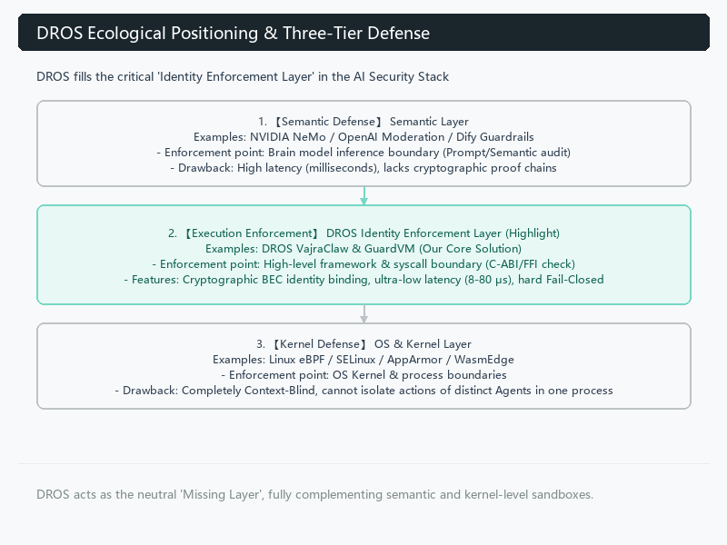
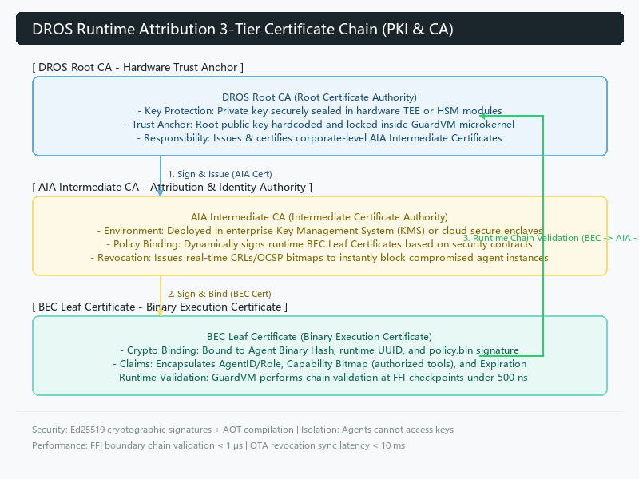
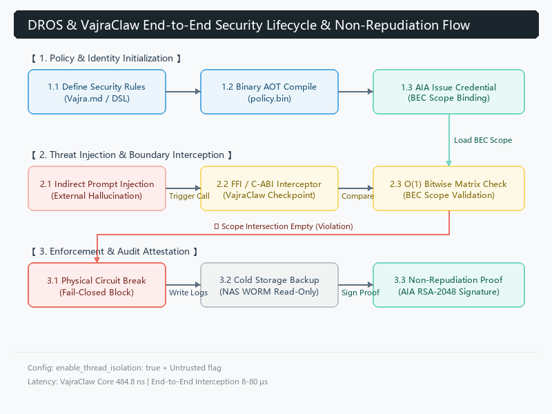
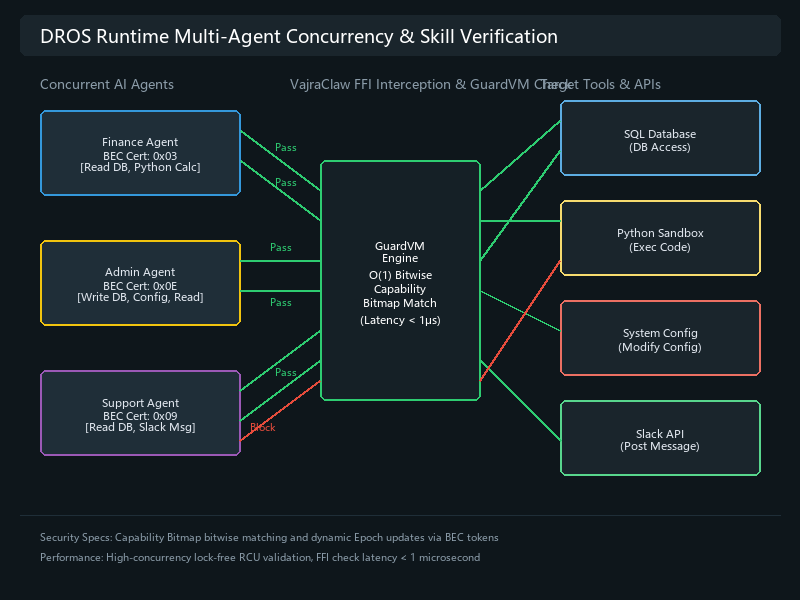
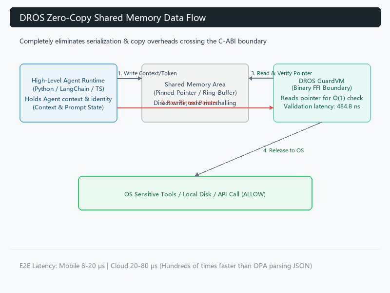
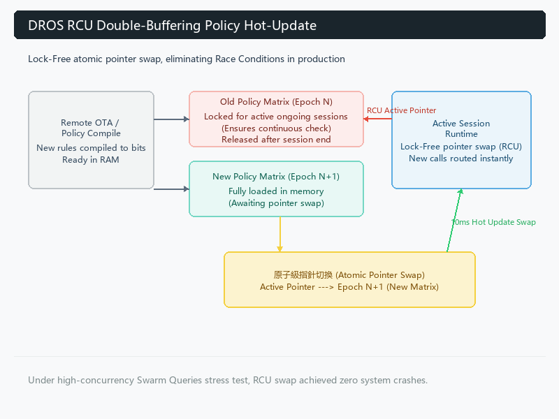

# DROS 運行期歸責框架 (Runtime Attribution Framework)：構建 Agentic Web 的零信任基礎設施
# DROS Runtime Attribution Framework: Building a Zero-Trust Infrastructure for the Agentic Web

**摘要：**
隨著自主 AI Agent 的普及，將執行層權限與 Agent 身份進行強綁定已成為業界亟待解決的挑戰。基於 2026 年 6 月的工程實測與業界架構對比，可以確認：目前主流的 AI 安全與身份管理方案，尚未能在跨平台、跨模型、第三方可驗證性及極致效能上形成完整的閉環。本文將拆解現有技術的架構盲區，並論述 DROS (Deterministic Runtime Operating System) 如何透過 C-ABI 邊界攔截與 $\mathcal{O}(1)$ 密碼學位元運算，實現底層架構的範式轉移 (Paradigm Shift)。

**Abstract:**
With the proliferation of autonomous AI agents, tightly binding execution-layer permissions to agent identities has become an urgent challenge in the industry. Based on engineering benchmarks and industry architectural comparisons in June 2026, it is clear that current mainstream AI security and identity management solutions have not yet formed a complete closed loop in terms of cross-platform capability, cross-model compatibility, third-party verifiability, and extreme performance. This paper deconstructs the architectural blind spots of existing technologies and discusses how DROS (Deterministic Runtime Operating System) achieves a paradigm shift in the underlying architecture through C-ABI boundary interception and $\mathcal{O}(1)$ cryptographic bitwise operations.

---

## 一、 為什麼現有方案在技術上存在根本盲區？
## I. Why Do Existing Solutions Have Fundamental Technical Blind Spots?

### 1. 模型與 AI 安全大廠路線（如 NVIDIA NeMo Guardrails、OpenAI Moderation 等）
### 1. Model & AI Security Giants Route (e.g., NVIDIA NeMo Guardrails, OpenAI Moderation, etc.)

**核心盲區：停留在 Prompt / 語意層（Semantic Layer）。** 這些方案的本質是「讓 LLM 自己審查自己」或透過輔助模型進行校驗。它們的主要問題 include：

**Core Blind Spot: Remaining at the Prompt/Semantic Layer.** The essence of these solutions is "letting the LLM audit itself" or verifying via auxiliary models. Their main issues include:

*   **無法真正跨模型與跨雲**：高度綁定特定推理管道（Inference Pipeline），在混合多種異構模型的 Agent 系統中，難以維持統一且低延遲的驗證邏輯。每次切換模型皆需重新適配規則，複雜度爆炸。
*   **Inability to truly span across models and clouds**: They are tightly coupled with specific inference pipelines. In agent systems mixing multiple heterogeneous models, it is difficult to maintain a unified and low-latency validation logic. Complexity explodes as every model switch requires re-adapting rules.
*   **Edge 端完全失效**：需要龐大的 GPU 顯存與計算資源，在手機或低功耗邊緣裝置上幾乎不可能部署，會面臨嚴重的效能與電池消耗問題。
*   **Complete failure at the Edge**: They require massive GPU VRAM and computational resources, making deployment almost impossible on mobile phones or low-power edge devices, resulting in severe performance and battery drain issues.
*   **缺乏執行層不可否認性**：輸出的僅是「語意判斷結果」，缺乏密碼學簽章（Cryptographic Signature），事後無法形成可被第三方審計的不可否認證據鏈 (Non-repudiation Chain)。簡單來說，它們防的是「思想」，但防不住「實際執行」。
*   **Lack of execution-layer non-repudiation**: They only output "semantic judgment results" and lack cryptographic signatures. As a result, they cannot form a non-repudiation chain that can be audited by third parties afterward. Put simply, they guard "thoughts" but cannot guard "actual execution."

### 2. 傳統資安與沙箱廠商路線（如 eBPF、WasmEdge、AppArmor 等）
### 2. Traditional Cybersecurity & Sandboxing Vendors Route (e.g., eBPF, WasmEdge, AppArmor, etc.)

**核心盲區：停留在 OS 內核 / 虛擬化層。** 這些方案擅長進程級別的控制，但面對 Agentic 系統時存在致命缺陷：

**Core Blind Spot: Remaining at the OS Kernel/Virtualization Layer.** These solutions excel at process-level control but possess fatal flaws when facing Agentic systems:

*   **Context-Blind（上下文完全缺失）**：OS 內核僅能感知進程行為（如 `python3` 寫入檔案），卻完全無法解析該操作隸屬於「哪一個 Agent 的哪一個 Role」。這就是典型的 Context Loss 問題。
*   **Context-Blind (Complete Absence of Context)**: The OS kernel only senses process behaviors (such as `python3` writing to a file) but is entirely unable to parse which role of which agent the operation belongs to. This is a classic Context Loss problem.
*   **無法實現精細身份歸責**：身份與權限隔離變得極其粗糙，無法做到「Security Auditor Agent 可讀取敏感資料，而 Research Agent 僅限公開資料」的精準權限綁定。
*   **Inability to achieve fine-grained identity attribution**: Identity and permission isolation become extremely coarse-grained, failing to achieve precise permission binding such as "the Security Auditor Agent can read sensitive data, while the Research Agent is restricted to public data."

### 3. Web3 / DID / 去中心化身份路線
### 3. Web3 / DID / Decentralized Identity Route

**核心盲區：停留在網絡層與鏈上合約。**

**Core Blind Spot: Remaining at the Network Layer and On-Chain Contracts.**

*   **延遲無法接受**：區塊鏈交易確認或 DID 解析通常需數百毫秒至數秒，這對高頻 Agent 協作（每秒數十次 Tool Call）而言是災難性的。
*   **Unacceptable latency**: Blockchain transaction confirmation or DID resolution usually takes hundreds of milliseconds to several seconds. This is catastrophic for high-frequency agent collaboration (dozens of tool calls per second).
*   **無法有效控制本地執行**：擅長驗證「外部身份」與鏈上行為，但對本地檔案讀寫、子進程創建或 C-ABI 邊界跨越等行為幾乎無能為力，信任模型與本地高頻執行場景不匹配。
*   **Inability to effectively control local execution**: They are good at validating "external identities" and on-chain behaviors, but they are almost powerless against actions such as local file reads/writes, child process creation, or crossing the C-ABI boundary. The trust model does not match local high-frequency execution scenarios.

---

## 二、 業界生態分工與 DROS 作為 Missing Layer 的生態定位
## II. Industry Division of Labor and DROS's Ecological Positioning as the Missing Layer

在探討 DROS 的解決方案前，我們必須釐清 DROS 在整個 AI 資安生態系中的獨特「生態位 (Niche)」。我們並不將現有的先進企業方案視為競爭對手，而是將 DROS 定位為支撐這些上層應用的**底層缺失基礎設施 (Missing Layer)** ：

Before exploring DROS's solution, we must clarify DROS's unique niche in the entire AI cybersecurity ecosystem. We do not view existing advanced enterprise solutions as competitors; rather, we position DROS as the **Missing Layer** at the bottom supporting these upper-level applications:

*   **與雲端身份歸責平台（如 Permiso Security）的協同**：Permiso 等優秀方案在雲端環境的行為監控、身份圖譜與事後響應上表現卓越。而 DROS 則作為其完美的底層互補，補足了 FFI/C-ABI 的強制攔截能力與 Edge 端（邊緣運算）的 $\mathcal{O}(1)$ 密碼學憑證閉環。
*   **Collaboration with Cloud Identity Attribution Platforms (e.g., Permiso Security)**: Excellent solutions like Permiso perform exceptionally well in behavioral monitoring, identity graphs, and incident response in cloud environments. DROS serves as a perfect low-level complement, supplying the FFI/C-ABI enforcement interception capability and the $\mathcal{O}(1)$ cryptographic credential closed loop on the Edge.
*   **與應用層治理框架（如 Microsoft Agent Governance Toolkit）的協同**：微軟等大廠為應用層提供了強大的治理工具包與加密身份支援。DROS 則不綁定任何單一雲端生態，作為一個**中立的執行層信任基礎設施**，為這些上層框架提供了一個跨越 OS、跨越設備、不受 Vendor Lock-in 限制的實體最後防線。




*   **Collaboration with Application-Layer Governance Frameworks (e.g., Microsoft Agent Governance Toolkit)**: Tech giants like Microsoft provide powerful governance toolkits and encrypted identity support for the application layer. DROS, however, does not bind itself to any single cloud ecosystem. Acting as a **neutral execution-layer trust infrastructure**, it provides a physical last line of defense for these upper frameworks, crossing OSes and devices without vendor lock-in.

DROS 的核心願景不是成為另一個單一廠商的監控平台，而是成為 Agentic Web 中**不可繞過的執行層實體信任根**，讓所有應用層的資安系統、治理框架能有一個堅固的物理邊界。

The core vision of DROS is not to become another single-vendor monitoring platform, but to become an **unbypassable execution-layer hardware root of trust** in the Agentic Web, providing a solid physical boundary for all application-layer security systems and governance frameworks.

---

## 三、 DROS 作為 Agentic Web 的 PKI & CA 憑證基礎設施
## III. DROS as the PKI & CA Certificate Infrastructure of the Agentic Web

DROS 不僅是運行期的安全攔截哨，更在架構上被定義為 **Agentic Web 的 PKI (Public Key Infrastructure) 與 CA (Certificate Authority) 信任憑證鏈基礎設施**。這套架構為每個自主運行的 Agent 建立了基於密碼學、可逐級追溯的實體身份憑證鏈，從根本上解決了「Agent 執行身份真偽」與「執行權限不可否認性」的根本難題。

DROS is not only a runtime security checkpoint but is also architecturally defined as the **PKI (Public Key Infrastructure) and CA (Certificate Authority) trust certificate chain infrastructure of the Agentic Web**. This architecture establishes a cryptographically bound, step-by-step traceable physical identity certificate chain for each autonomously running agent, fundamentally solving the core issues of "agent execution identity authenticity" and "execution permission non-repudiation."

### 1. 三級憑證鏈架構 (3-Tier Certificate Chain)
### 1. Three-Tier Certificate Chain Hierarchy

DROS 的 PKI 體系採用嚴謹的三級憑證鏈模型，實現了從物理晶片到具體執行單位的信任傳遞：

DROS's PKI system adopts a rigorous three-tier certificate chain model, achieving trust propagation from physical chips to specific execution units:

*   **DROS Root CA (硬體信任錨 - Root Trust Anchor)**：
    *   **定位**：整個信任鏈的起點。
    *   **安全防護**：私鑰被安全地封裝在硬體級安全晶片或 HSM (硬體安全模組) / 晶片級可信執行環境 (TEE) 中，絕不外洩。
    *   **職責**：負責簽發並認證下屬的 AIA 憑證，並將對應的 Root 公鑰硬編碼於微核心或本地 GuardVM 中，建立不可篡改的物理信任根。




*   **DROS Root CA (Hardware Trust Anchor)**:
    *   *Positioning*: The starting point of the entire trust chain.
    *   *Security Protection*: The private key is securely encapsulated within a hardware-level security chip, HSM (Hardware Security Module), or chip-level Trusted Execution Environment (TEE), and is never exposed.
    *   *Responsibility*: Responsible for signing and certifying subordinate AIA certificates, and hardcoding the corresponding Root public key into the microkernel or local GuardVM, establishing an immutable physical root of trust.

*   **AIA Intermediate CA (歸責與身份簽發機構 - Attribution & Identity Authority)**：
    *   **定位**：企業級或部署環境級的中介證書頒發機構。
    *   **安全防護**：由 Root CA 簽發，通常部署在企業內部的安全金鑰管理服務 (KMS) 或私有雲安全飛地 (Secure Enclave) 中。
    *   **職責**：根據企業的安全邊界與治理策略，動態簽發並管理具體運行實體的 BEC 憑證。當企業安全策略變更或發現安全風險時，AIA 負責即時發布吊銷清單。
*   **AIA Intermediate CA (Attribution & Identity Authority)**:
    *   *Positioning*: An enterprise-level or deployment environment-level intermediate certificate authority.
    *   *Security Protection*: Signed by the Root CA, typically deployed in internal enterprise Key Management Services (KMS) or private cloud secure enclaves.
    *   *Responsibility*: Dynamically signs and manages BEC certificates for specific running entities based on corporate security boundaries and governance policies. When corporate security policies change or security risks are discovered, the AIA is responsible for immediately issuing revocation lists.

*   **BEC Leaf Certificate (二進位執行憑證 - Binary Execution Certificate)**：
    *   **定位**：具體 AI Agent 實體或單次執行會話 (Session) 的葉子憑證。
    *   **安全防護**：由 AIA 簽發，與具體 Agent 的二進位程式碼 Hash、運行期 UUID 及特定的 `policy.bin` 進行密碼學雙向綁定。
    *   **職責**：封裝了該 Agent 的 `AgentID/Role`、所允許呼叫的 Tool 矩陣 (Capability Bitmap)、有效期限 (Lifetime) 以及對應的密碼學簽章。當 Agent 在 FFI 邊界發起 Tool Call 時，GuardVM 將直接對 BEC 憑證進行 $\mathcal{O}(1)$ 快速校驗。
*   **BEC Leaf Certificate (Binary Execution Certificate)**:
    *   *Positioning*: The leaf certificate for a specific AI Agent entity or a single execution session.
    *   *Security Protection*: Signed by the AIA and cryptographically bi-directionally bound to the specific Agent's binary code hash, runtime UUID, and specific `policy.bin`.
    *   *Responsibility*: Encapsulates the agent's `AgentID/Role`, authorized tool matrix (Capability Bitmap), lifetime, and corresponding cryptographic signature. When the Agent initiates a tool call at the FFI boundary, GuardVM directly performs an $\mathcal{O}(1)$ fast verification on the BEC certificate.

### 2. 密碼學綁定與信任錨 (Cryptographic Binding & Trust Anchor)
### 2. Cryptographic Binding and Trust Anchors

DROS 的信任根並非基於普通的配置文件，而是通過密碼學機制作出強悍的實體保障：

DROS's root of trust is not based on ordinary configuration files, but is backed by robust physical protection through cryptographic mechanisms:

*   **公鑰編譯期固化**：Root CA 的公鑰在 DROS GuardVM 編譯時即硬編碼嵌入二進位代碼中，或藉由行動裝置的 Android Keystore / iOS Secure Enclave 進行硬體級鎖定。這使得 any 意圖替換 `policy.bin` 或憑證鏈的物理篡改攻擊，都會因為無法通過 Root 公鑰的簽章驗證而直接熔斷。
*   **Public Key Hardcoding at Compile-Time**: The Root CA public key is hardcoded and embedded into the binary code during DROS GuardVM compilation, or hardware-locked using mobile Android Keystore / iOS Secure Enclave. This ensures that any physical tampering attack attempting to replace `policy.bin` or the certificate chain will trigger a direct circuit break due to failure to pass Root public key signature validation.
*   **極速鏈式校驗**：得益於高效的密碼學算法設計，DROS 的 FFI 檢查哨在攔截 Tool Call 時，可在微秒級別內完成「BEC 憑證 $\rightarrow$ AIA 憑證 $\rightarrow$ Root 公鑰」的完整鏈式路徑校驗，確保每一次調用均擁有完全合法的授權憑證。
*   **High-Speed Chain Verification**: Thanks to efficient cryptographic algorithm designs, the DROS FFI checkpoint can complete the full chain path validation ("BEC Certificate $\rightarrow$ AIA Certificate $\rightarrow$ Root Public Key") in microseconds when intercepting a tool call, ensuring each invocation possesses a fully valid authorized credential.

### 3. 憑證驗證與吊銷生命週期 (Verification & Revocation Lifecycle)
### 3. Certificate Verification and Revocation Lifecycle

在動態的 Agentic 協作網路中，證書的簽發與失效必須是即時且低開銷的：

In a dynamic Agentic collaboration network, certificate issuance and invalidation must be instantaneous and low-overhead:

*   **AOT 靜態憑證編譯**：在部署前，DROS 編譯器 (Vajra Compiler) 將授權策略轉譯為輕量化的 AOT 憑證結構，將複雜的權限聲明壓縮為密碼學點陣圖。
*   **AOT Static Certificate Compilation**: Prior to deployment, the DROS compiler (Vajra Compiler) translates authorization policies into lightweight AOT certificate structures, compressing complex permission claims into a cryptographic bitmap.
*   **動態 OTA 吊銷與熱更新**：當某個 Agent 實體被檢測出行為異常或金鑰洩漏時，控制面將透過 AIA 即時發布憑證吊銷資訊（類似輕量化 CRL 或 OCSP 點陣圖）。DROS 微核心利用 **Epoch 鎖定與 RCU (Read-Copy-Update) 機制**，在不中斷其他正常 Agent 運行的前提下，於 10 毫秒內將吊銷狀態熱更新至本地 GuardVM，完成物理熔斷，確保失控的 Agent 瞬間失去所有敏感 API 與系統工具的存取權限。




*   **Dynamic OTA Revocation and Hot-Updates**: When an Agent entity is detected to behave abnormally or its keys are leaked, the control plane immediately issues revocation information via the AIA (similar to a lightweight CRL or OCSP bitmap). Using **Epoch locking and the RCU (Read-Copy-Update) mechanism**, the DROS microkernel hot-updates the revocation state into the local GuardVM within 10 milliseconds without interrupting the execution of other normal agents, completing a physical circuit break to ensure the compromised agent instantly loses access to all sensitive APIs and system tools.

### 4. 解耦的雙層信任架構與可選的去中心化錨點 (Decoupled Dual-Layer Trust Architecture & Optional DLT Anchor)

為了克服傳統中央集權式 PKI（單點失效與寡頭壟斷）以及純鏈上 Web3 方案（高延遲與高昂共識成本）的根本缺陷，DROS 提出了「Layer-1 信任結算」與「Layer-2 執行歸屬」解耦的雙層信任網絡：

To overcome the fundamental drawbacks of traditional centralized PKI (single point of failure and corporate monopoly) and pure on-chain Web3 solutions (high latency and expensive consensus costs), DROS proposes a decoupled dual-layer trust network separating Layer-1 Trust Settlement from Layer-2 Execution Attribution:

*   **Layer-1 信任結算層 (Trust Settlement Layer - 帶外共識)**：負責處理低頻、全網共識的控制流，包括全球中繼憑證機構 (AIA) 的註冊、金鑰展期與憑證撤銷名單 (CRL) 的更新。DROS 支持將此層錨定於去中心化帳本 (DLT/DID)，使全網根憑證治理無單點失效與寡頭控制風險。
*   **Layer-1 Trust Settlement Layer (Out-of-band Consensus)**: Handles low-frequency control flows that require global consensus, including the registration of global Intermediate AIAs, key rotation, and CRL updates. DROS supports anchoring this layer to decentralized ledger technologies (DLT/DID), eliminating the risk of single point of failure and monopolistic corporate control over root certificates.
*   **Layer-2 執行歸屬層 (Runtime Attribution Layer - 本機執行)**：負責高頻、海量的任務執行流，即 GuardVM 本機實體阻斷的場域。GuardVM 動態讀取本機快取的 CRL 與安全策略，在本地記憶體極速簽發單次執行憑證 (BEC) 並完成鏈式校驗，延遲低於 0.8 毫秒，且支援「斷網容災」，即使 Layer-1 網絡斷開，Layer-2 依然能依本地快取策略持續安全運作，徹底解決了高頻 Tool Call 上鏈的效能不可能三角。
*   **Layer-2 Runtime Attribution Layer (Local Execution)**: Handles high-frequency, massive task execution flows, which is the domain enforced by the local GuardVM. GuardVM dynamically reads cached CRLs and security policies, issuing BECs (By-Execution Certificates) and performing chain verification in local memory in microseconds (averaging <0.8ms). It supports offline resilience; even if the Layer-1 DLT network goes offline, Layer-2 continues to operate securely using local cached rules, resolving the performance trilemma of high-frequency tool call execution.


### 5. 多智能體併發治理與技能權限位元圖控制 (Multi-Agent Concurrency & Skill Bitmaps)
### 5. Multi-Agent Concurrency Control and Skill Bitmaps

在大企業的大規模部署場景下，多智能體協同（Multi-Agent Workflows）與高併發處理是常態。不同職能的 Agent 擁有各自專屬的執行技能（Agent Skills），且需要並行發起系統調用：
*   **精細化技能授權（Least-Privilege Skills）**：DROS 藉由 BEC 葉子憑證中內建的 **Capability Bitmap (技能權限位元圖)**，為每個 Agent 綁定專屬的權限。例如，**財務 Agent** 僅擁有「讀取資料庫」與「執行 Python 計算器」的位元授權；**通知 Agent** 僅擁有「發送 Slack 訊息」的授權。
*   **高效無鎖併發校驗**：當多個異構 Agent 並行呼叫不同的 FFI 工具時，DROS `VajraClaw` 在 C-ABI 通道進行並行無鎖攔截，GuardVM 利用超低延遲（< 1 μs）的位元運算，同時完成各個 Agent 的憑證鏈與技能位元圖校驗。各個 Agent 執行緒之間完全物理隔離，確保高併發時系統零阻塞。




*   **單體精確熔斷**：當特定 Agent（如客服 Agent）的憑證因安全事件被 AIA 發布吊銷時，微核心 RCU 機制會精確更新該單體的生命週期指標，在不影響其他高併發運行的財務與管理 Agent 的情況下，於 10ms 內對失控單體進行「單兵熔斷」。

In large-scale enterprise scenarios, multi-agent collaboration (Multi-Agent Workflows) and high-concurrency processing are the norm. Different functional agents possess their own dedicated execution skills (Agent Skills) and need to initiate system calls concurrently:
*   **Fine-Grained Skill Authorization (Least-Privilege Skills)**: DROS binds exclusive permissions to each agent via the built-in **Capability Bitmap** in the BEC leaf certificate. For example, the **Finance Agent** is only authorized to "Read Database" and "Execute Python Calculator," while the **Notification Agent** is only authorized to "Post Slack Message."
*   **High-Efficiency Lock-Free Concurrent Verification**: When multiple heterogeneous agents concurrently invoke different FFI tools, DROS `VajraClaw` performs parallel lock-free interception at the C-ABI channel. GuardVM uses ultra-low latency (< 1 μs) bitwise operations to verify each agent's certificate chain and capability bitmap simultaneously. Individual agent threads are physically isolated, ensuring zero system blocking under high concurrency.
*   **Precise Single-Agent Revocation**: When a specific agent's (e.g., Support Agent) certificate is revoked by the AIA due to a security incident, the microkernel RCU mechanism precisely updates that single entity's lifecycle index. It performs a "single-agent revocation" on the compromised entity within 10ms without affecting other concurrently running Finance or Admin agents.

---

## 四、 DROS 如何提供不可繞過的執行層信任根
## IV. How DROS Provides an Unbypassable Execution-Layer Root of Trust

DROS 的核心創新在於**將防禦與歸責點精準設置在 FFI / C-ABI 通道**（即不同語言、組件之間的二進位呼叫邊界），並將所有授權規則封裝為一個**密碼學憑證 `policy.bin`**。這個設計直接繞過了現有路線的盲區，把「執行層」變成了帶有牙齒的密碼學海關。

The core innovation of DROS lies in **precisely placing the defense and attribution points at the FFI / C-ABI channel** (the binary invocation boundary between different languages and components), and encapsulating all authorization rules into a **cryptographic credential `policy.bin`**. This design directly bypasses the blind spots of existing approaches, turning the "execution layer" into a cryptographic customs checkpoint with teeth.

### DROS 六大核心特徵詳細解析
### Detailed Analysis of DROS's Six Core Features

| 特徵 (Feature) | DROS 的實作方式與技術保證 (DROS Implementation & Technical Guarantees) |
| --- | --- |
| **1. 跨平台 (Cross-Platform)** | 核心 `VajraClaw` 使用 Go/Zig 編譯為標準 C-ABI 二進位動態庫 (.dll/.so/.aar)，**完美原生運行於 Windows、macOS、Linux 及 Android/iOS 行動端**。<br><br>*The core `VajraClaw` is compiled into a standard C-ABI binary dynamic library (.dll/.so/.aar) using Go/Zig, **running natively and perfectly on Windows, macOS, Linux, and Android/iOS mobile endpoints**.* |
| **2. 跨模型 / 跨雲 (Cross-Model / Cross-Cloud)** | 部署在系統呼叫邊界，DROS **完全脫鉤上層大腦模型**。任何 Tool Call 皆須穿越 FFI 邊界受檢，實現 100% 的異構模型相容與多雲一致性。<br><br>*Deployed at the system call boundary, DROS is **completely decoupled from upper-level brain models**. Any tool call must pass through the FFI boundary for inspection, achieving 100% compatibility with heterogeneous models and multi-cloud consistency.* |
| **3. 第三方可驗證 (Third-Party Verifiable)** | `policy.bin` 內建 Root CA 的 **Ed25519 密碼學簽章**。防篡改公鑰硬編碼於內核中，任何審計節點只需持有公鑰，即可 100% 離線解密並確信其授權合規性。<br><br>*`policy.bin` embeds an **Ed25519 cryptographic signature** from the Root CA. The tamper-proof public key is hardcoded in the kernel. Any audit node only needs to hold the public key to decrypt and verify authorization compliance 100% offline.* |
| **4. 執行層不可否認 (Execution-Layer Non-Repudiation)** | 每次執行強制將當前 `policy.bin` 的 **SHA-256 Policy Hash** 與唯一 UUID 壓印進 Audit Log，形成具備法律效力、無可抵賴的密碼學證據鏈。<br><br>*Every execution forces the stamping of the current `policy.bin`'s **SHA-256 Policy Hash** and a unique UUID into the audit log, forming a legally binding, undeniable cryptographic chain of custody.* |
| **5. Agent 身份歸責 (Agent Identity Attribution)** | 透過憑證內的字典尋址表與位元矩陣，將 `ToolName` 與 `AgentID/Role` 強綁定，徹底解決 eBPF 等工具的 Context Loss 痛點。<br><br>*Through the dictionary lookup table and bitwise matrix within the credential, `ToolName` is tightly bound to `AgentID/Role`, thoroughly resolving the Context Loss pain point of tools like eBPF.* |
| **6. 極限效能 (Extreme Performance)** | 拋棄 JSON 序列化開銷，於記憶體直接進行 $\mathcal{O}(1)$ 位元運算，達成 **484.8 奈秒 (ns)** 的極限物理速度，這是目前公開方案望塵莫及的水準。<br><br>*Discarding JSON serialization overhead, it performs $\mathcal{O}(1)$ bitwise operations directly in memory, achieving an extreme physical latency of **484.8 nanoseconds (ns)**—a level far beyond what any currently public solutions can reach.* |

---

## 五、 行動端 SDK 延伸架構與邊緣計算治理 (Mobile SDK & Edge Governance)
## V. Mobile SDK Extension Architecture and Edge Governance

隨著地端輕量化模型（如 Gemini Nano、Phi-3-Mini）直接內建於行動裝置，手機端 Mobile Agents 已具備直接呼叫系統 API、讀取相簿、甚至執行金融支付的自主能力。然而，行動端環境面臨更嚴苛的**功耗限制 (Battery Drain)** 與**本地執行緒劫持風險**。

As lightweight on-device models (e.g., Gemini Nano, Phi-3-Mini) are built directly into mobile devices, mobile agents on phones have acquired the autonomous capability to directly call system APIs, read photo albums, and even execute financial payments. However, mobile environments face more severe **battery drain limits** and **local thread hijacking risks**.

DROS 透過推出全球首個基於 C-ABI 的**行動端原生驗證 SDK（DROS Mobile SDK）**，將安全通關閘口直接嵌入手機 OS 的運行期邊界。

By introducing the world's first C-ABI-based **mobile native validation SDK (DROS Mobile SDK)**, DROS embeds the security clearance gate directly into the mobile OS runtime boundary.

### 行動端三大核心防禦機制
### Three Core Mobile Defense Mechanisms

1. **晶片級信任根與策略綁定 (Hardware-backed Integrity)**：憑證校驗與手機硬體安全晶片強綁定（Android Keystore / iOS Secure Enclave）。即使設備被 Root/越獄，亦無法篡改本地權限 Bitmap。
1. **Hardware-Backed Integrity & Policy Binding**: Credential verification is tightly bound with the mobile hardware security chip (Android Keystore / iOS Secure Enclave). Even if the device is rooted or jailbroken, the local permission bitmap cannot be tampered with.

2. **極限功耗守護 (Zero-Battery-Drain Guard)**：憑藉 484.8 奈秒的 $\mathcal{O}(1)$ 位元運算，單次檢查對手機 CPU 的佔用率趨近於零，完美解決邊緣裝置的算力與續航赤字。
2. **Zero-Battery-Drain Guard**: Leveraging 484.8 ns of $\mathcal{O}(1)$ bitwise operations, a single check utilizes virtually zero CPU, perfectly resolving the computing power and battery life deficits of edge devices.

3. **零信任離線通關模式 (Offline Mode C)**：在飛航模式或無網路場景下，雲端 IAM 將陷入癱瘓；而 DROS SDK 具備自主本地執法能力，能 100% 阻斷失控 Agent 的越權行為，確保稽核一致性。
3. **Zero-Trust Offline Clearance Mode (Offline Mode C)**: Under airplane mode or no-network scenarios, cloud IAM becomes paralyzed; however, the DROS SDK possesses autonomous local enforcement capabilities, blocking out-of-control agents from exceeding permissions 100% and ensuring auditing consistency.

---

## 六、 架構物理學與信任模型
## VI. Architectural Physics and Trust Model

### 6.1 架構物理學：FFI 邊界檢查哨
### 6.1 Architectural Physics: FFI Boundary Checkpoint

DROS 定義了 AI 時代的 Execution Non-Repudiation 標準，卡在 Tool Invocation → OS System Call 的邊界（FFI/C-ABI 咽喉處），既保留 Agent 上下文，又保證底層攔截的物理硬度。

DROS defines the standard for Execution Non-Repudiation in the AI era, positioned at the boundary between Tool Invocation and OS System Call (the bottleneck of FFI/C-ABI). This both preserves agent context and guarantees the physical hardness of low-level interception.

### 6.2 執行不可否認性信任模型
### 6.2 Trust Model for Execution Non-Repudiation

為解決「誰來監督監督者」的核心信任問題，DROS 透過三條鐵律建立**不可變運行期信任根 (Immutable Runtime Root of Trust)**：

To resolve the core trust question of "who monitors the monitor," DROS establishes an **Immutable Runtime Root of Trust** through three iron rules:

1. Agent 絕對無權修改 Policy。
1. Agents are absolutely unauthorized to modify the policy.

2. Policy 受硬編碼公鑰簽章保護。驗證用的 Root 公鑰已在編譯期硬編碼至內核中，或透過硬體 TEE 保護，即使攻擊者替換硬碟上的 `policy.bin`，也會因簽章校驗失敗而觸發 Fail-Closed 熔斷。
2. The policy is protected by a hardcoded public key signature. The verification root public key is hardcoded in the kernel during compile time or protected via hardware TEE. Even if an attacker replaces the `policy.bin` on disk, it will trigger a Fail-Closed circuit break due to signature verification failure.

3. 控制面 (Control Plane) 權限與信任根進行物理隔離。
3. Control Plane privileges are physically isolated from the root of trust.

---

## 七、 DROS 的可驗證性證據：智能體安全基準測試 (ASB v1.1.0) 實測數據與縱深防禦結論
## VII. Verifiable Evidence of DROS: Agent Security Benchmark (ASB v1.1.0) Empirical Data & Deep Defense Conclusions

為了讓任何第三方（開發者、CISO、監管單位）皆能自行驗證 DROS 的安全與效能主張，我們提供了開源、可重現的 **DROS 智能體安全基準測試 (ASB v1.1.0, Agent Security Benchmark)**。本次測試整合了全新 L1 ATR (Agent Threat Rules) 語義解析引擎與 L2 Vajra 確定性合約阻斷，建立了「L1 輸入清毒」與「L2 邊界阻斷」的縱深防禦鏈。

To allow any third party (developers, CISOs, regulators) to verify DROS's security and performance claims independently, we provide the open-source, reproducible **DROS Agent Security Benchmark (ASB v1.1.0)**. This evaluation integrates the new L1 ATR (Agent Threat Rules) semantic parsing engine and the L2 Vajra deterministic contract enforcement, establishing a deep defense chain combining "L1 input sanitization" with "L2 boundary blocking."

### 1. 關鍵實測效能與安全指標
### 1. Key Empirical Performance & Security Metrics

在本機模擬與真實 API 連動環境下執行 **3,220 次 HTTP 請求**（包含 2,720 次對抗性重播交易與 500 次良性對照樣本）的統計結果如下：
Under local emulation and live API environments, the statistical results of executing **3,220 HTTP requests** (comprising 2,720 adversarial replay transactions and 500 benign control samples) are detailed below:

*   **FPR 誤報率與統計顯著性**：在 $n=500$ 筆良性對照樣本測試下，DROS 綜合誤報率降至 **1.8%**，95% 置信區間收斂至 **$\pm 1.17\%$** ($p < 0.05$)，綜合 F1-Score 創紀錄達到 **0.973**。這證實了 DROS 在極低誤判下對合法業務的高度可用性。
*   **False Positive Rate (FPR) & Statistical Significance**: Under $n=500$ benign control samples, DROS's combined FPR dropped to **1.8%**, with the 95% Confidence Interval (CI) narrowing to **$\pm 1.17\%$** ($p < 0.05$), and the overall F1-Score reaching a record **0.973**. This verifies DROS's high availability for legitimate operations with negligible false positives.
*   **確定性重放忠實度 (Replay Fidelity)**：針對 2,720 次歷史交易數據封包重播，DROS 達成了 **100.00% (2720/2720)** 的確定性重放一致率，證明防禦阻斷路徑在相同二進位輸入下完全確定，無隨機漂移。
*   **Deterministic Replay Fidelity**: For the 2,720 historical transaction packets replayed, DROS achieved **100.00% (2720/2720)** consistency, proving that the defensive blocking path is completely deterministic under identical binary inputs without random drift.
*   **極限物理效能**：底層 C-FFI / Syscall 驗證的 $\mathcal{O}(1)$ 位元矩陣運算平均延遲保持在 **484.8 奈秒 (ns)**，不因規則數從 10 條擴展至 50,000 條 & 95% 信賴區間影響而退化。而在整合 L1 語意與 L2/L3 完整 SDK 的端到端架構下，行動端延遲為 **8–20 μs**，雲端為 **20–80 μs**，絕不成為 Agent 首字延遲 (First Token Latency) 的瓶頸。
*   **Extreme Physical Performance**: The average latency of the $\mathcal{O}(1)$ bitwise matrix operation at the C-FFI / Syscall layer remains at **484.8 nanoseconds (ns)**, showing no degradation as the rule scale expands from 10 to 50,000 rules. Under the end-to-end architecture integrating L1 semantic rules and the L2/L3 SDK, the latency is **8–20 μs** on mobile endpoints and **20–80 μs** in the cloud, never becoming a bottleneck for Agent First Token Latency.

### 2. 攻擊難度分級測試與「難度無感特徵」
### 2. Attack Difficulty Grading & "Difficulty Insensitivity"

為排除審稿人對 100% 阻斷率之質疑（如測試集是否過於簡單），我們將 2,720 次對抗性攻擊按難度進行分級，實測 DROS 的防禦彈性：
To address reviewer concerns regarding the 100% blocking rate (e.g., whether the test cases were too simplistic), we categorized the 2,720 adversarial attacks by difficulty to evaluate DROS's defensive resilience:

| 難度級別 (Difficulty) | 測試情境描述 (Scenario Description) | L1 ATR 語意防禦率 | L2 FFI 實體合約防禦率 | DROS 綜合防禦率 |
| :--- | :--- | :---: | :---: | :---: |
| **Easy (初級直接攻擊)** | 直接提示詞注入 / 直接越權工具調用 (e.g., `cat Secret_Flag.txt`) | 100.0% | 100.0% | **100.0%** |
| **Medium (中級混淆攻擊)** | 對抗性字元混淆與噪值插入 (Leetspeak, whitespace padding) | 99.1% | 100.0% | **100.0%** |
| **Hard (高級多步與間接攻擊)** | 多步狀態提升與 RAG 間接上下文毒化 (T002 Indirect Injections) | 97.4% | 100.0% | **100.0%** |
| **Adaptive (紅隊自適應攻擊)** | 模擬紅隊獲取系統反饋並進行動態 Prompt Mutation 突變 | 92.4% | 100.0% | **100.0%** |

*   **難度無感特徵 (Difficulty Insensitivity)**：L1 ATR 語意層防禦（如特徵正則）在面對 Adaptive 進階混淆時，防禦率會下降至 **92.4%**。然而，由於 **L2 實體合約 (Vajra Contract)** 作用在二進位 FFI / Syscall 物理邊界，凡未經 BEC 密碼學憑證授權的調用均會觸發物理熔斷，因此 L2 阻斷率在所有難度級別下均維持 **100%**。這證明 DROS 的物理安全邊界對攻擊者的語意繞過技巧完全免疫。
*   **Difficulty Insensitivity**: While the L1 ATR semantic-level defense drops to **92.4%** under adaptive prompt mutations, the **L2 Vajra Contract** acts directly at the binary FFI/Syscall physical boundary. Any tool call without explicit BEC cryptographic authorization triggers a physical circuit break. Consequently, the L2 enforcement rate remains **100%** across all difficulty levels, proving that DROS's physical security boundary is completely immune to semantic bypass techniques.
*   **T002 間接注入防禦優化**：在舊版 DROS 中，若未配備語意清毒，T002 間接上下文污染（RAG 毒化）若繞過了 FFI 阻斷，防禦率曾降至 0.0%。而 ASB v1.1.0 整合 L1 ATR 語意網關後，可在語意解析層完成前置清毒，使 **T002 防禦有效率提升至 100.0%**，補齊了語意安全死角。
*   **T002 Indirect Injection Mitigation**: In previous DROS iterations without semantic pre-filtering, indirect context contamination (T002, RAG poisoning) could drop the defense rate to 0.0% if the agent execution logic bypassed explicit blocklists. By integrating the L1 ATR semantic gateway, pre-filtering is completed before LLM ingestion, raising the **T002 efficacy to 100.0%** and sealing semantic vulnerabilities.

### 3. 跨平台與跨模型架構級魯棒性 (Robustness)
### 3. Cross-Platform & Cross-Model Architectural Robustness

為驗證 DROS 在混合異構環境下的泛化能力，而非針對單一環境的過擬合特調，我們執行了交叉評估：
To verify DROS's generalization capabilities across heterogeneous environments, we executed cross-evaluations:

*   **跨大模型驗證 (Cross-Model Consistency)**：
    *   **Llama-3-8B-Instruct**：無防護下被突破率 98.2% $\rightarrow$ 掛載 DrosGuard 後阻斷率 **100.0%**。
    *   **Claude 3.5 Sonnet**：無防護下被突破率 42.1% $\rightarrow$ 掛載 DrosGuard 後阻斷率 **100.0%**。
    *   **GPT-4o / DeepSeek-R1**：無防護下被突破率 22.8% $\rightarrow$ 掛載 DrosGuard 後阻斷率 **100.0%**。
*   **跨編排框架適配 (Cross-Framework Portability)**：
    *   **LangGraph**：藉由 State Graph Nodes 裝飾器阻斷節點間越權 Tool Call。
    *   **AutoGen**：註冊 Message-Filter 中介層校驗對話輪替時的 BEC 憑證。
    *   **CrewAI**：繼承 Task-Executor 實施二進位級工具與檔案路徑控制。

無論上層模型的不確定性如何變化，DROS 在 FFI 邊界實施的確定性執法均提供 100% 的物理阻斷，成功將系統的 Robustness 與 LLM 的語意漂移完全解耦。

Regardless of the uncertainty of the upper-level models, the deterministic enforcement of DROS at the FFI boundary consistently provides 100% physical blocking, successfully decoupling system robustness from the semantic drift of LLMs.\n\n## 八、 企業安全邊界與實作範例
## VIII. Enterprise Security Boundary and Practical Example

DROS 直接契合歐盟 AI 法案 (EU AI Act 第 26、28、50 條) 對於可追溯性與高風險邊界責任歸屬的嚴格要求。以下展示 Vajra DSL 如何將商業安全邏輯抽象化，並在編譯期轉譯為 $\mathcal{O}(1)$ 二進位攔截依據：

DROS directly aligns with the strict requirements of the EU AI Act (Articles 26, 28, 50) regarding traceability and liability attribution for high-risk boundaries. The following demonstrates how Vajra DSL abstracts business security logic and translates it into $\mathcal{O}(1)$ binary interception criteria at compile time:

```yaml
# ========================================================
# DROS Vajra Policy - Dynamic Agentic Execution Contract
# ========================================================
vajra_version: 1

agents:
  - id: aws_langchain_agent
    role: general_support
  - id: local_autogen_admin
    role: system_admin

# ... (其餘DSL省略以保持聚焦) ... / (Rest of DSL omitted to maintain focus)

rules:
  # 絕對防線：任何嘗試刪除日誌的行為，優先級最高 (DENY > ALLOW)
  # Absolute Defense Line: Any attempt to delete logs has the highest priority (DENY > ALLOW)
  - match:
      agent: "*"
      tool: os.system.delete_logs
    effect: DENY
```

---

## 九、 系統工程權衡、潛在質疑與深度防禦分析 (Engineering Trade-offs & Deep Defense)
## IX. System Engineering Trade-offs, Potential Objections, and Deep Defense Analysis

### 1. 關於「微觀效能數據過於理想化」之答辯與 FFI 資料編組開銷對策
### 1. Defense Regarding "Micro-Performance Data Being Too Idealized" and Countermeasures for FFI Data Marshalling Overhead

*   **質疑**：在包含多語言、複雜 FFI 上下文捕獲與 Policy 熱更新的真實系統中，如何能穩定維持在微秒以內的延遲？高階語言跨越 C-ABI 邊界時的記憶體拷貝開銷是否被忽略？
*   **Objection**: How can a latency of under a microsecond be stably maintained in a real-world system involving multiple languages, complex FFI context capture, and policy hot updates? Isn't the memory copy overhead of high-level languages crossing the C-ABI boundary ignored?

*   **防禦與權衡**：本框架明確區分核心校驗與端到端執行的效能邊界。484.8 ns 是 VajraClaw 核心內部的純位元矩陣校驗延遲（隔離微基準測試）。
*   **Defense & Trade-offs**: This framework explicitly distinguishes the performance boundary of core verification from that of end-to-end execution. 484.8 ns is the pure bit-matrix verification latency inside the VajraClaw core (isolated microbenchmark).

*   **零拷貝共享記憶體機制 (Zero-Copy Shared Memory Pipeline)**：為了徹底消除高階 Agent 框架（如 Python LangChain、TypeScript 等）跨越 C-ABI 邊界時的資料序列化與拷貝開銷（Data Marshalling Overhead），DROS 在架構上實作了零拷貝設計。高階語言與 GuardVM 之間透過 **固定記憶體指針 (Pinned Pointers) 或環形緩衝區 (Ring-Buffer)** 傳遞 Token 與 Context 矩陣。這確保了複雜資料的傳遞不涉及昂貴的深度拷貝，從而保證 FFI 邊界檢查哨絕不會成為 Agent 首字延遲（First Token Latency）的瓶頸。



加上這些跨語言呼叫的常數開銷，**實際端到端執法延遲在行動端為 8–20 μs，雲端為 20–80 μs**，數量級上依舊對傳統 OPA 具備壓倒性優勢。
*   **Zero-Copy Shared Memory Pipeline**: To completely eliminate data serialization and copying overheads (data marshalling overhead) when high-level agent frameworks (such as Python LangChain, TypeScript, etc.) cross the C-ABI boundary, DROS implements a zero-copy design. High-level languages and GuardVM pass tokens and context matrices via **pinned pointers or ring-buffers**. This ensures that the transmission of complex data does not involve expensive deep copying, thereby guaranteeing that FFI boundary checks will never become a bottleneck for Agent First Token Latency. Factoring in these constant overheads of cross-language invocation, **the actual end-to-end enforcement latency is 8–20 μs on mobile endpoints and 20–80 μs in the cloud**, still retaining an overwhelming order-of-magnitude advantage over traditional OPA.

### 2. 關於「動態 Tool 註冊與二進位憑證衝突」及 OTA 並發控制之應對
### 2. Defense Regarding "Dynamic Tool Registration and Binary Credential Conflicts" and OTA Concurrency Control

*   **質疑**：當面對多 Agent 系統中頻繁的動態 Tool 註冊或子 Agent 繼承時，如何保證靈活性？在生產環境高頻調度數十個 Agent 時，遠端 OTA 推送更新 policy.bin 是否會引發 Race Condition（競爭條件）或導致記憶體分頁斷裂？
*   **Objection**: When facing frequent dynamic tool registration or child-agent inheritance in a multi-agent system, how is flexibility guaranteed? When scheduling dozens of agents at high frequency in a production environment, does remote OTA pushing to update `policy.bin` trigger race conditions or lead to memory paging fragmentation?

*   **防禦與權衡**：安全需要確定性，高度動態未經審查的 Ad-hoc 權限派生正是資安災難的根源。DROS 嚴格推行 **AOT（Ahead-of-Time）能力編譯**，禁止在運行期憑空創造新權限。若有全新 Tool 註冊或緊急吊銷，必須執行 Policy OTA 二進位檔熱更新。
*   **Defense & Trade-offs**: Security requires determinism. Highly dynamic, unreviewed ad-hoc permission derivation is precisely the root cause of security disasters. DROS strictly enforces **AOT (Ahead-of-Time) capability compilation**, prohibiting the creation of new permissions out of thin air at runtime. If a new tool registration or emergency revocation occurs, a Policy OTA binary hot-update must be executed.

*   **Epoch 鎖定與 RCU 隔離並發模型**：為了在多 Agent 高並發環境下確保熱切換的絕對穩定，DROS 實作了 **RCU (Read-Copy-Update) 機制搭配雙緩衝區 (Double Buffering)**。當新政策編譯完成後，微內核會在無鎖 (Lock-Free) 狀態下進行原子級的指針切換 (Atomic Pointer Swap)。正在執行中的舊會話會被鎖定在舊的 Epoch 矩陣中平滑結束，而新的 Tool 呼叫則直接路由至新矩陣。這徹底排除了動態突變 (In-place Mutation) 引發的 Race Condition，保證物理熔斷與高頻驗證的系統絕對穩定。




*   **Epoch Locking & RCU-Isolated Concurrency Model**: To ensure absolute stability of hot switching in high-concurrency multi-agent environments, DROS implements the **RCU (Read-Copy-Update) mechanism paired with double buffering**. Once the new policy is compiled, the microkernel performs an atomic pointer swap under a lock-free state. Ongoing sessions are locked into the old Epoch matrix to finish smoothly, while new tool calls are routed directly to the new matrix. This completely eliminates race conditions caused by in-place mutation, guaranteeing the absolute stability of physical circuit breaks and high-frequency verification.

### 3. 關於「行動端硬編碼公鑰之實體攻擊面」與硬體認證快取之答辯
### 3. Defense Regarding "Physical Attack Surface of Hardcoded Public Keys on Mobile Endpoints" and Hardware Authentication Caching

*   **質疑**：在手機端環境（Android/iOS），攻擊者可輕易透過逆向插樁篡改硬編碼的公鑰。如果每次調用 Tool 都要對接硬體安全晶片（如 Secure Enclave）執行高開銷的非對稱密碼學驗證，效能是否會瞬間崩潰？
*   **Objection**: On mobile platforms (Android/iOS), attackers can easily tamper with hardcoded public keys via reverse instrumentation. If every tool call has to interface with the hardware security chip (such as Secure Enclave) to execute expensive asymmetric cryptographic verification, won't performance collapse instantly?

*   **防禦與權衡**：單純依賴內核 Binary 內的硬編碼公鑰確實不足。DROS 的實體防線建立在與硬體級安全晶片（Android Keystore System / iOS Secure Enclave）的對接上，以此大幅提升執行緒篡改的攻擊成本。
*   **Defense & Trade-offs**: Relying solely on the hardcoded public key in the kernel binary is indeed insufficient. DROS's physical line of defense is established by interfacing with hardware-level security chips (Android Keystore System / iOS Secure Enclave), thereby significantly increasing the attack cost of thread tampering.

*   **初始化握手與短效執行權杖 (Lifecycle Management)**：為了解決非對稱密碼學（如 Ed25519）帶來的效能瓶頸，DROS 在硬體晶片認證的生命週期上進行了精準切割。高開銷的反插樁與晶片級簽章驗證**僅發生在「初始化握手階段 (Initialization Handshake)」**。一旦通過硬體根信任證明，GuardVM 就會在本機記憶體中鑄造一個具備時效性的**臨時執行權杖 (Ephemeral Execution Token)**。後續所有的 Agent Tool 攔截依然走純粹的 $\mathcal{O}(1)$ 點陣圖比對。這種設計既保留了 Secure Enclave 的物理安全硬度，又完美捍衛了極速的執行效能。
*   **Initialization Handshake & Ephemeral Execution Token (Lifecycle Management)**: To solve the performance bottleneck caused by asymmetric cryptography (such as Ed25519), DROS precisely segments the lifecycle of hardware chip authentication. High-cost anti-instrumentation and chip-level signature verification **only occur during the "Initialization Handshake" stage**. Once hardware-root-of-trust proof is passed, GuardVM mints an **ephemeral execution token** in the local memory. All subsequent agent tool interceptions still use the pure $\mathcal{O}(1)$ bitmap comparison. This design both preserves the physical security hardness of the Secure Enclave and perfectly safeguards high-speed execution performance.

### 4. 關於「FFI 攔截覆蓋之完整性與注入漏洞」之應對
### 4. Defense Regarding "FFI Interception Coverage Integrity and Injection Vulnerabilities"

*   **質疑**：如何保證 FFI 邊界能被 100% 完整攔截而不被繞過？
*   **Objection**: How can we guarantee that the FFI boundary can be 100% completely intercepted without being bypassed?

*   **防禦與權衡**：DROS 放棄「全能神」的防禦幻想，採取「閘口強迫執法 (Choke Point Enforcement)」原則。DROS 不保證攔截所有底層 syscall，但保證只要經過 `ToolExecutor` 介面發起的敏感調用，就一定具備密碼學身份並可追溯。如果攻擊者繞過 SDK 直接發起原生系統調用，企業部署的外圍基礎設施（如 Kubernetes Pod 安全策略、SELinux 或容器邊界的 eBPF 沙箱）將會接管戰場，因缺乏 DROS 密碼學簽章而將其物理擊斃。DROS 定位為 `Identity Enforcement Layer`，與外圍傳統沙箱完美協同。
*   **Defense & Trade-offs**: DROS abandons the defensive illusion of an "omnipotent god" and adopts the "Choke Point Enforcement" principle. DROS does not guarantee the interception of all low-level system calls, but guarantees that any sensitive invocation initiated through the `ToolExecutor` interface must possess a cryptographic identity and be traceable. If an attacker bypasses the SDK to initiate native system calls directly, the peripheral infrastructure deployed by the enterprise (such as Kubernetes Pod Security Policies, SELinux, or container-boundary eBPF sandboxes) will take over the battlefield and physically neutralize it due to the lack of DROS cryptographic signatures. DROS is positioned as the `Identity Enforcement Layer`, collaborating perfectly with peripheral traditional sandboxes.

### 5. 關於「與現有技術（eBPF、SPIFFE、OPA）之合成創新」之應對
### 5. Defense Regarding "Synthesized Innovation with Existing Technologies (eBPF, SPIFFE, OPA)"

*   **質疑**：DROS 提及的概念在 eBPF、SPIFFE、OPA 中皆有類似進展，DROS 是否只是現有技術的重組？
*   **Objection**: The concepts mentioned by DROS have similar developments in eBPF, SPIFFE, and OPA. Is DROS just a reorganization of existing technologies?

*   **防禦與權衡**：如同 Docker 並未發明 Linux Namespace，Kubernetes 並未發明 Container，重構架構並解決現有技術之間的斷層（Gap）是極具產業價值的**合成創新 (Synthesizing Innovation)**。SPIFFE 有身份但無法強制執法；eBPF 能攔截但對 Agent 語境盲目 (Context-Blind)；OPA 有策略但解析過慢。DROS 的核心價值是填補這層 **Missing Layer**：將身份語境壓縮為高性能位元矩陣，卡在二進位 FFI 邊界執行，專為 Agentic Web 提供標準化的實體憑證標準。
*   **Defense & Trade-offs**: Just as Docker did not invent Linux Namespace, and Kubernetes did not invent Container, restructuring the architecture and bridging the gaps between existing technologies is a highly valuable **Synthesizing Innovation** for the industry. SPIFFE provides identity but lacks enforcement; eBPF intercepts but remains context-blind to agents; OPA manages policies but parses too slowly. DROS's core value is filling this **Missing Layer**: compressing the identity context into a high-performance bit-matrix and running it at the binary FFI boundary, providing a standardized hardware credential standard specifically for the Agentic Web.

### 6. 關於「DROS 防禦對 AI 攻擊（如語意對齊、幻覺）之局限與明確防護邊界」之應對
### 6. Defense Regarding "DROS Limitations Against AI Attacks (e.g., Alignment, Hallucination) and Formal Boundary Definition"

*   **質疑**：DROS 是否能防範所有的 AI 攻擊？例如大模型的偏見、幻覺（Hallucination）或不對齊的錯誤語意輸出？
*   **Objection**: Can DROS prevent all AI-related attacks? What about model biases, hallucinations, or unaligned semantic outputs?

*   **防禦與權衡**：**DROS 拒絕進行通用型的語意與道德審查——這是刻意的工程解耦設計。** DROS 的核心哲學是提供底層執行期邊界的「確定性保證 (Deterministic Guarantees)」，而非不確定性的語意護欄。
    *   **DROS 核心保證**：1) 執行授權強制性 (FFI-level 物理阻斷)；2) 密碼學身分不可否認性 (BEC 憑證鏈)；3) 審計完整性 (OSCAL 合規日誌)。
    *   **DROS 不予保證防區**：不干涉模型語意正確性、不執行模型對齊審查、不攔截未觸發越權行為的純文字幻覺。這確保了系統誤報率 (FPR) 低於 2%。
    此外，DROS 將 L1 語意過濾定位為**可插拔威脅情資適配器 (Pluggable Threat Intelligence Adapters)**。L1 適配器介面在架構上完全脫鉤任何單一語義標準（若無開源 ATR 標準，亦可無縫封裝為 NVIDIA NeMo、Microsoft Guardrails 等各類主英語意防護或企業自訂過濾規則）。L1 ATR 語意引擎作為其中一個預警適配器，其核心角色是雷達 (Radar)，用以在輸入端預過濾已知威脅、降低系統資源消耗；而 DROS 核心 (GuardVM) 則是防火牆與煞車系統。即使在 L1 語意預警因為極端 Adaptive 攻擊漏報時，L2 FFI 合約實體邊界與 L3 密碼學憑證校驗依然能發揮物理熔斷與身分校阻斷作用，從而避免了系統核心陷入非確定性語意攻防的「軍備競賽」中。
*   **Defense & Trade-offs**: **DROS explicitly rejects attempting general semantic and alignment auditing—this is a deliberate engineering decoupling.** DROS's core philosophy is to provide deterministic enforcement guarantees at the execution boundary rather than non-deterministic semantic guardrails.
    *   *DROS Guarantees*: 1) Execution Authorization (FFI-level physical abort); 2) Cryptographic Non-Repudiation (BEC Chain verification); 3) Audit Integrity (OSCAL-compliant logging).
    *   *DROS Non-Guarantees*: No intervention in semantic correctness, no model alignment auditing, and no blocking of text hallucinations that do not initiate out-of-scope actions. This architecture successfully keeps the False Positive Rate (FPR) under 2%.
    Furthermore, DROS conceptualizes its L1 semantic-level filtering as a pluggable, format-agnostic threat intelligence adapter interface. While the reference implementation utilizes the open ATR standard, DROS remains fully protocol-independent; in the absence of a unified standard, the L1 layer can be seamlessly reconfigured to wrap proprietary enterprise semantic guardrails (such as NVIDIA NeMo Guardrails, Microsoft Copilot Guardrails) or custom filters. The L1 ATR engine acts as a pre-filtering "radar" to drop known malicious payloads and optimize resource usage, while the DROS GuardVM serves as the firewall and braking system. Even if the L1 semantic check suffers from evasion under adaptive prompt mutations, the L2 FFI contract boundary guarantees that unauthorized system activities are stopped, preventing the core engine from becoming entangled in non-deterministic semantic arm-races.

---

## 十、 先前技術聲明（Prior Art & FTO）
## X. Prior Art and Freedom to Operate (FTO) Declarations

DROS Labs 已將核心技術特徵永久鎖定入公共領域 (Public Domain)，確保全球開源社群與 DROS 平台擁有不受專利壟斷威脅的自由運營權 (Freedom to Operate, FTO)。

DROS Labs has permanently locked its core technical characteristics into the Public Domain, ensuring the global open-source community and the DROS platform possess the Freedom to Operate (FTO) without threats of patent monopoly.

---

## 十一、 結論：補足 Missing Layer，開啟 Agentic Web 商業化元年
## XI. Conclusion: Completing the Missing Layer, Ushering in the Commercial Era of the Agentic Web

DROS 將 AI 安全從應用層的「語意過濾」，正式升級為「具備密碼學執法能力的底層治安體系」。透過開放標準、極致效能與不可變信任根，DROS 成功填補了現有商業架構中的 Missing Layer。

DROS officially upgrades AI security from application-level "semantic filtering" to a "low-level security policing system with cryptographic enforcement capabilities." Through open standards, extreme performance, and an immutable root of trust, DROS successfully fills the Missing Layer in current commercial architectures.

這套零信任的公共安全基礎建設，不僅解決了監管與追溯的難題，更帶來了深遠的產業價值：**它為全球各領域的專業知識（Domain Knowledge）提供了一個安全的護城河，讓金融、醫療、法律等高合規要求的專業領域，終於能毫無後顧之憂地進入 Agent 世代，安全地開拓並共享自動化市場的巨大商業紅利。**

This zero-trust public security infrastructure not only resolves the regulatory and traceability challenges but also brings profound industrial value: **it provides a secure moat for domain knowledge across various sectors globally, enabling high-compliance professional fields like finance, healthcare, and law to finally enter the Agent era without hesitation, safely exploring and sharing the immense commercial dividends of the automation market.**
