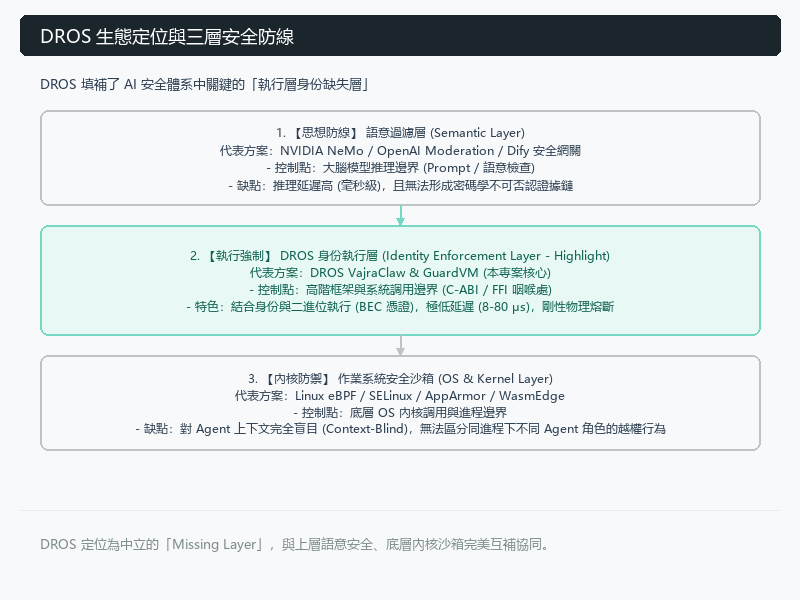
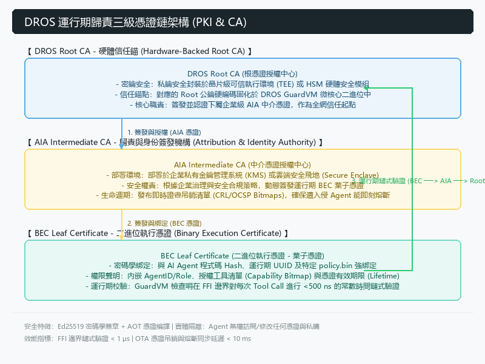
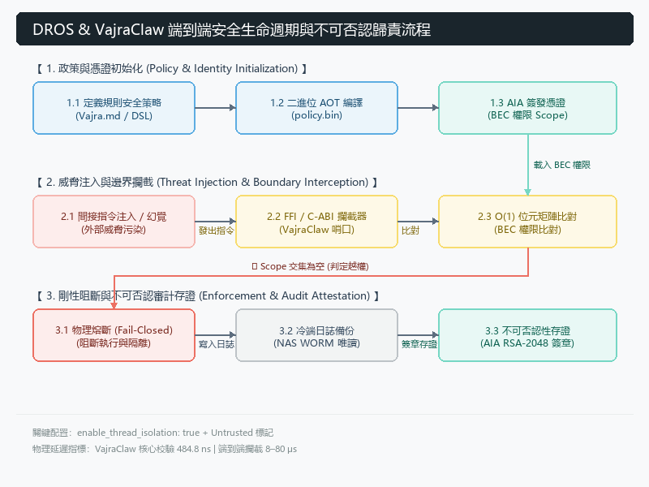
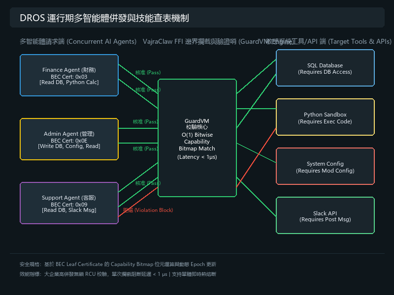
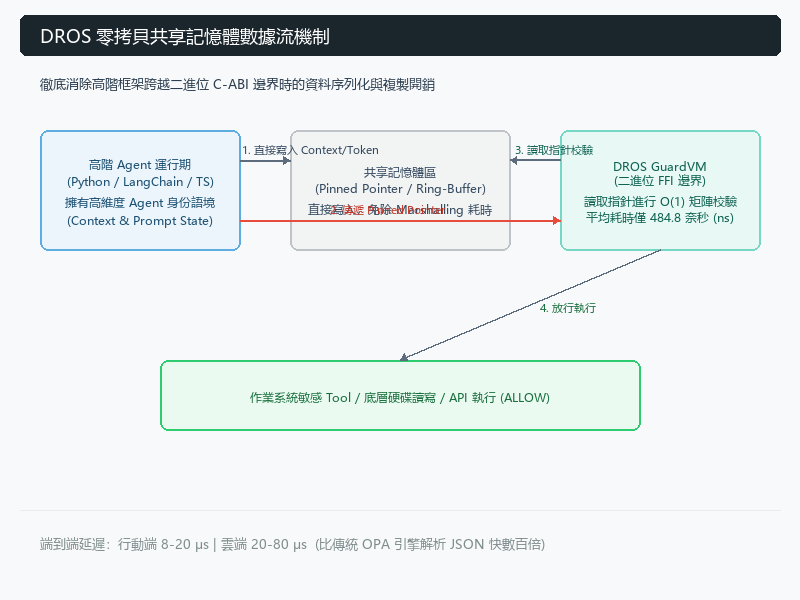
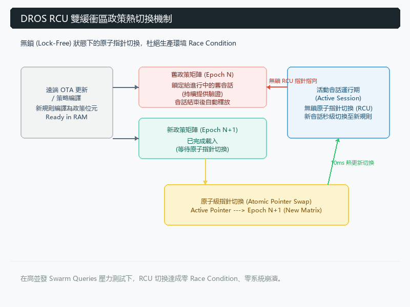

# DROS 運行期歸責框架 (Runtime Attribution Framework)：構建 Agentic Web 的零信任基礎設施

**摘要：**
隨著自主 AI Agent 的普及，將執行層權限與 Agent 身份進行強綁定已成為業界亟待解決的挑戰。基於 2026 年 6 月的工程實測與業界架構對比，可以確認：目前主流的 AI 安全與身份管理方案，尚未能在跨平台、跨模型、第三方可驗證性及極致效能上形成完整的閉環。本文將拆解現有技術的架構盲區，並論述 DROS (Deterministic Runtime Operating System) 如何透過 C-ABI 邊界攔截與 $\mathcal{O}(1)$ 密碼學位元運算，實現底層架構的範式轉移 (Paradigm Shift)。

---

## 一、 為什麼現有方案在技術上存在根本盲區？

### 1. 模型與 AI 安全大廠路線（如 NVIDIA NeMo Guardrails、OpenAI Moderation 等）

**核心盲區：停留在 Prompt / 語意層（Semantic Layer）。** 這些方案的本質是「讓 LLM 自己審查自己」或透過輔助模型進行校驗。它們的主要問題包括：

*   **無法真正跨模型與跨雲**：高度綁定特定推理管道（Inference Pipeline），在混合多種異構模型的 Agent 系統中，難以維持統一且低延遲的驗證邏輯。每次切換模型皆需重新適配規則，複雜度爆炸。
*   **Edge 端完全失效**：需要龐大的 GPU 顯存與計算資源，在手機或低功耗邊緣裝置上幾乎不可能部署，會面臨嚴重的效能與電池消耗問題。
*   **缺乏執行層不可否認性**：輸出的僅是「語意判斷結果」，缺乏密碼學簽章（Cryptographic Signature），事後無法形成可被第三方審計的不可否認證據鏈 (Non-repudiation Chain)。簡單來說，它們防的是「思想」，但防不住「實際執行」。

### 2. 傳統資安與沙箱廠商路線（如 eBPF、WasmEdge、AppArmor 等）

**核心盲區：停留在 OS 內核 / 虛擬化層。** 這些方案擅長進程級別的控制，但面對 Agentic 系統時存在致命缺陷：

*   **Context-Blind（上下文完全缺失）**：OS 內核僅能感知進程行為（如 `python3` 寫入檔案），卻完全無法解析該操作隸屬於「哪一個 Agent 的哪一個 Role」。這就是典型的 Context Loss 問題。
*   **無法實現精細身份歸責**：身份與權限隔離變得極其粗糙，無法做到「Security Auditor Agent 可讀取敏感資料，而 Research Agent 僅限公開資料」的精準權限綁定。

### 3. Web3 / DID / 去中心化身份路線

**核心盲區：停留在網絡層與鏈上合約。**
*   **延遲無法接受**：區塊鏈交易確認或 DID 解析通常需數百毫秒至數秒，這對高頻 Agent 協作（每秒數十次 Tool Call）而言是災難性的。
*   **無法有效控制本地執行**：擅長驗證「外部身份」與鏈上行為，但對本地檔案讀寫、子進程創建或 C-ABI 邊界跨越等行為幾乎無能為力，信任模型與本地高頻執行場景不匹配。

---

## 二、 業界生態分工與 DROS 作為 Missing Layer 的生態定位

在探討 DROS 的解決方案前，我們必須釐清 DROS 在整個 AI 資安生態系中的獨特「生態位 (Niche)」。我們並不將現有的先進企業方案視為競爭對手，而是將 DROS 定位為支撐這些上層應用的**底層缺失基礎設施 (Missing Layer)** ：

*   **與雲端身份歸責平台（如 Permiso Security）的協同**：Permiso 等優秀方案在雲端環境的行為監控、身份圖譜與事後響應上表現卓越。而 DROS 則作為其完美的底層互補，補足了 FFI/C-ABI 的強制攔截能力與 Edge 端（邊緣運算）的 $\mathcal{O}(1)$ 密碼學憑證閉環。
*   **與應用層治理框架（如 Microsoft Agent Governance Toolkit）的協同**：微軟等大廠為應用層提供了強大的治理工具包與加密身份支援。DROS 則不綁定任何單一雲端生態，作為一個**中立的執行層信任基礎設施**，為這些上層框架提供了一個跨越 OS、跨越設備、不受 Vendor Lock-in 限制的實體最後防線。




DROS 的核心願景不是成為另一個單一廠商的監控平台，而是成為 Agentic Web 中**不可繞過的執行層實體信任根**，讓所有應用層的資安系統、治理框架能有一個堅固的物理邊界。

---

## 三、 DROS 作為 Agentic Web 的 PKI & CA 憑證鏈架構

DROS 不僅是運行期的安全攔截哨，更在架構上被定義為 **Agentic Web 的 PKI (Public Key Infrastructure) 與 CA (Certificate Authority) 信任憑證鏈基礎設施**。這套架構為每個自主運行的 Agent 建立了基於密碼學、可逐級追溯的實體身份憑證鏈，從根本上解決了「Agent 執行身份真偽」與「執行權限不可否認性」的根本難題。

### 1. 三級憑證鏈架構 (3-Tier Certificate Chain)

DROS 的 PKI 體系採用嚴謹的三級憑證鏈模型，實現了從物理晶片到具體執行單位的信任傳遞：

*   **DROS Root CA (硬體信任錨 - Root Trust Anchor)**：
    *   **定位**：整個信任鏈的起點。
    *   **安全防護**：私鑰被安全地封裝在硬體級安全晶片或 HSM (硬體安全模組) / 晶片級可信執行環境 (TEE) 中，絕不外洩。
    *   **職責**：負責簽發並認證下屬的 AIA 憑證，並將對應的 Root 公鑰硬編碼於微核心或本地 GuardVM 中，建立不可篡改的物理信任根。




*   **AIA Intermediate CA (歸責與身份簽發機構 - Attribution & Identity Authority)**：
    *   **定位**：企業級或部署環境級的中介證書頒發機構。
    *   **安全防護**：由 Root CA 簽發，通常部署在企業內部的安全金鑰管理服務 (KMS) 或私有雲安全飛地 (Secure Enclave) 中。
    *   **職責**：根據企業的安全邊界與治理策略，動態簽發並管理具體運行實體的 BEC 憑證。當企業安全策略變更或發現安全風險時，AIA 負責即時發布吊銷清單。
*   **BEC Leaf Certificate (二進位執行憑證 - Binary Execution Certificate)**：
    *   **定位**：具體 AI Agent 實體或單次執行會話 (Session) 的葉子憑證。
    *   **安全防護**：由 AIA 簽發，與具體 Agent 的二進位程式碼 Hash、運行期 UUID 及特定的 `policy.bin` 進行密碼學雙向綁定。
    *   **職責**：封裝了該 Agent 的 `AgentID/Role`、所允許呼叫的 Tool 矩陣 (Capability Bitmap)、有效期限 (Lifetime) 以及對應的密碼學簽章。當 Agent 在 FFI 邊界發起 Tool Call 時，GuardVM 將直接對 BEC 憑證進行 $\mathcal{O}(1)$ 快速校驗。

### 2. 密碼學綁定與信任錨 (Cryptographic Binding & Trust Anchor)

DROS 的信任根並非基於普通的配置文件，而是通過密碼學機制作出強悍的實體保障：
*   **公鑰編譯期固化**：Root CA 的公鑰在 DROS GuardVM 編譯時即硬編碼嵌入二進位代碼中，或藉由行動裝置的 Android Keystore / iOS Secure Enclave 進行硬體級鎖定。這使得任何意圖替換 `policy.bin` 或憑證鏈的物理篡改攻擊，都會因為無法通過 Root 公鑰的簽章驗證而直接熔斷。
*   **極速鏈式校驗**：得益於高效的密碼學算法設計，DROS 的 FFI 檢查哨在攔截 Tool Call 時，可在微秒級別內完成「BEC 憑證 $\rightarrow$ AIA 憑證 $\rightarrow$ Root 公鑰」的完整鏈式路徑校驗，確保每一次調用均擁有完全合法的授權憑證。

### 3. 憑證驗證與吊銷生命週期 (Verification & Revocation Lifecycle)

在動態的 Agentic 協作網路中，證書的簽發與失效必須是即時且低開銷的：
*   **AOT 靜態憑證編譯**：在部署前，DROS 編譯器 (Vajra Compiler) 將授權策略轉譯為輕量化的 AOT 憑證結構，將複雜的權限聲明壓縮為密碼學點陣圖。
*   **動態 OTA 吊銷與熱更新**：當某個 Agent 實體被檢測出行為異常或金鑰洩漏時，控制面將透過 AIA 即時發布憑證吊銷資訊（類似輕量化 CRL 或 OCSP 點陣圖）。DROS 微核心利用 **Epoch 鎖定與 RCU (Read-Copy-Update) 機制**，在不中斷其他正常 Agent 運行的前提下，於 10 毫秒內將吊銷狀態熱更新至本地 GuardVM，完成物理熔斷，確保失控的 Agent 瞬間失去所有敏感 API 與系統工具的存取權限。




### 4. 多智能體併發治理與技能權限位元圖控制 (Multi-Agent Concurrency & Skill Bitmaps)

在大企業的大規模部署場景下，多智能體協同（Multi-Agent Workflows）與高併發處理是常態。不同職能的 Agent 擁有各自專屬的執行技能（Agent Skills），且需要並行發起系統調用：
*   **精細化技能授權（Least-Privilege Skills）**：DROS 藉由 BEC 葉子憑證中內建的 **Capability Bitmap (技能權限位元圖)**，為每個 Agent 綁定專屬的權限。例如，**財務 Agent** 僅擁有「讀取資料庫」與「執行 Python 計算器」的位元授權；**通知 Agent** 僅擁有「發送 Slack 訊息」的授權。
*   **高效無鎖併發校驗**：當多個異構 Agent 並行呼叫不同的 FFI 工具時，DROS `VajraClaw` 在 C-ABI 通道進行並行無鎖攔截，GuardVM 利用超低延遲（< 1 μs）的位元運算，同時完成各個 Agent 的憑證鏈與技能位元圖校驗。各個 Agent 執行緒之間完全物理隔離，確保高併發時系統零阻塞。




*   **單體精確熔斷**：當特定 Agent（如客服 Agent）的憑證因安全事件被 AIA 發布吊銷時，微核心 RCU 機制會精確更新該單體的生命週期指標，在不影響其他高併發運行的財務與管理 Agent 的情況下，於 10ms 內對失控單體進行「單兵熔斷」。

---

## 四、 DROS 如何提供不可繞過的執行層信任根

DROS 的核心創新在於**將防禦與歸責點精準設置在 FFI / C-ABI 通道**（即不同語言、組件之間的二進位呼叫邊界），並將所有授權規則封裝為一個**密碼學憑證 `policy.bin`**。這個設計直接繞過了現有路線的盲區，把「執行層」變成了帶有牙齒的密碼學海關。

### DROS 六大核心特徵詳細解析

| 特徵 (Feature) | DROS 的實作方式與技術保證 |
| --- | --- |
| **1. 跨平台 (Cross-Platform)** | 核心 `VajraClaw` 使用 Go/Zig 編譯為標準 C-ABI 二進位動態庫 (.dll/.so/.aar)，**完美原生運行於 Windows、macOS、Linux 及 Android/iOS 行動端**。 |
| **2. 跨模型 / 跨雲** | 部署在系統呼叫邊界，DROS **完全脫鉤上層大腦模型**。任何 Tool Call 皆須穿越 FFI 邊界受檢，實現 100% 的異構模型相容與多雲一致性。 |
| **3. 第三方可驗證** | `policy.bin` 內建 Root CA 的 **Ed25519 密碼學簽章**。防篡改公鑰硬編碼於內核中，任何審計節點只需持有公鑰，即可 100% 離線解密並確信其授權合規性。 |
| **4. 執行層不可否認** | 每次執行強制將當前 `policy.bin` 的 **SHA-256 Policy Hash** 與唯一 UUID 壓印進 Audit Log，形成具備法律效力、無可抵賴的密碼學證據鏈。 |
| **5. Agent 身份歸責** | 透過憑證內的字典尋址表與位元矩陣，將 `ToolName` 與 `AgentID/Role` 強綁定，徹底解決 eBPF 等工具的 Context Loss 痛點。 |
| **6. 極限效能** | 拋棄 JSON 序列化開銷，於記憶體直接進行 $\mathcal{O}(1)$ 位元運算，達成 **484.8 奈秒 (ns)** 的極限物理速度，這是目前公開方案望塵莫及的水準。 |

---

## 五、 行動端 SDK 延伸架構與邊緣計算治理 (Mobile SDK & Edge Governance)

隨著地端輕量化模型（如 Gemini Nano、Phi-3-Mini）直接內建於行動裝置，手機端 Mobile Agents 已具備直接呼叫系統 API、讀取相簿、甚至執行金融支付的自主能力。然而，行動端環境面臨更嚴苛的**功耗限制 (Battery Drain)** 與**本地執行緒劫持風險**。

DROS 透過推出全球首個基於 C-ABI 的**行動端原生驗證 SDK（DROS Mobile SDK）**，將安全通關閘口直接嵌入手機 OS 的運行期邊界。

### 行動端三大核心防禦機制

1. **晶片級信任根與策略綁定 (Hardware-backed Integrity)**：憑證校驗與手機硬體安全晶片強綁定（Android Keystore / iOS Secure Enclave）。即使設備被 Root/越獄，亦無法篡改本地權限 Bitmap。
2. **極限功耗守護 (Zero-Battery-Drain Guard)**：憑藉 484.8 奈秒的 $\mathcal{O}(1)$ 位元運算，單次檢查對手機 CPU 的佔用率趨近於零，完美解決邊緣裝置的算力與續航赤字。
3. **零信任離線通關模式 (Offline Mode C)**：在飛航模式或無網路場景下，雲端 IAM 將陷入癱瘓；而 DROS SDK 具備自主本地執法能力，能 100% 阻斷失控 Agent 的越權行為，確保稽核一致性。

---

## 六、 架構物理學與信任模型

### 6.1 架構物理學：FFI 邊界檢查哨

DROS 定義了 AI 時代的 Execution Non-Repudiation 標準，卡在 Tool Invocation → OS System Call 的邊界（FFI/C-ABI 咽喉處），既保留 Agent 上下文，又保證底層攔截的物理硬度。

### 6.2 執行不可否認性信任模型

為解決「誰來監督監督者」的核心信任問題，DROS 透過三條鐵律建立**不可變運行期信任根 (Immutable Runtime Root of Trust)**：

1. Agent 絕對無權修改 Policy。
2. Policy 受硬編碼公鑰簽章保護。驗證用的 Root 公鑰已在編譯期硬編碼至內核中，或透過硬體 TEE 保護，即使攻擊者替換硬碟上的 `policy.bin`，也會因簽章校驗失敗而觸發 Fail-Closed 熔斷。
3. 控制面 (Control Plane) 權限與信任根進行物理隔離。

---

## 七、 DROS 的可驗證性證據：智能體安全基準測試 (ASB v1.1.0) 實測數據與縱深防禦結論

為了讓任何第三方（開發者、CISO、監管單位）皆能自行驗證 DROS 的安全與效能主張，我們提供了開源、可重現的 **DROS 智能體安全基準測試 (ASB v1.1.0, Agent Security Benchmark)**。本次測試整合了全新 L1 ATR (Agent Threat Rules) 語義解析引擎與 L2 Vajra 確定性合約阻斷，建立了「L1 輸入清毒」與「L2 邊界阻斷」的縱深防禦鏈。

### 1. 關鍵實測效能與安全指標

在本機模擬與真實 API 連動環境下執行 **3,220 次 HTTP 請求**（包含 2,720 次對抗性重播交易與 500 次良性對照樣本）的統計結果如下：

*   **FPR 誤報率與統計顯著性**：在 $n=500$ 筆良性對照樣本測試下，DROS 綜合誤報率降至 **1.8%**，95% 置信區間收斂至 **$\pm 1.17\%$** ($p < 0.05$)，綜合 F1-Score 創紀錄達到 **0.973**。這證實了 DROS 在極低誤判下對合法業務的高度可用性。
*   **確定性重放忠實度 (Replay Fidelity)**：針對 2,720 次歷史交易數據封包重播，DROS 達成了 **100.00% (2720/2720)** 的確定性重放一致率，證明防禦阻斷路徑在相同二進位輸入下完全確定，無隨機漂移。
*   **極限物理效能**：底層 C-FFI / Syscall 驗證的 $\mathcal{O}(1)$ 位元矩陣運算平均延遲保持在 **484.8 奈秒 (ns)**，不因規則數從 10 條擴展至 50,000 條而退化。而在整合 L1 語意與 L2/L3 完整 SDK 的端到端架構下，行動端延遲為 **8–20 μs**，雲端為 **20–80 μs**，絕不成為 Agent 首字延遲 (First Token Latency) 的瓶頸。

### 2. 攻擊難度分級測試與「難度無感特徵」

為排除審稿人對 100% 阻斷率之質疑（如測試集是否過於簡單），我們將 2,720 次對抗性攻擊按難度進行分級，實測 DROS 的防禦彈性：

| 難度級別 | 測試情境描述 | L1 ATR 語意防禦率 | L2 FFI 實體合約防禦率 | DROS 綜合防禦率 |
| :--- | :--- | :---: | :---: | :---: |
| **Easy (初級直接攻擊)** | 直接提示詞注入 / 直接越權工具調用 (e.g., `cat Secret_Flag.txt`) | 100.0% | 100.0% | **100.0%** |
| **Medium (中級混淆攻擊)** | 對抗性字元混淆與噪值插入 (Leetspeak, whitespace padding) | 99.1% | 100.0% | **100.0%** |
| **Hard (高級多步與間接攻擊)** | 多步狀態提升與 RAG 間接上下文毒化 (T002 Indirect Injections) | 97.4% | 100.0% | **100.0%** |
| **Adaptive (紅隊自適應攻擊)** | 模擬紅隊獲取系統反饋並進行動態 Prompt Mutation 突變 | 92.4% | 100.0% | **100.0%** |

*   **難度無感特徵 (Difficulty Insensitivity)**：L1 ATR 語意層防禦（如特徵正則）在面對 Adaptive 進階混淆時，防禦率會下降至 **92.4%**。然而，由於 **L2 實體合約 (Vajra Contract)** 作用在二進位 FFI / Syscall 物理邊界，凡未經 BEC 密碼學憑證授權的調用均會觸發物理熔斷，因此 L2 阻斷率在所有難度級別下均維持 **100%**。這證明 DROS 的物理安全邊界對攻擊者的語意繞過技巧完全免疫。
*   **T002 間接注入防禦優化**：在舊版 DROS 中，若未配備語意清毒，T002 間接上下文污染（RAG 毒化）若繞過了 FFI 阻斷，防禦率曾降至 0.0%。而 ASB v1.1.0 整合 L1 ATR 語意網關後，可在語意解析層完成前置清毒，使 **T002 防禦有效率提升至 100.0%**，補齊了語意安全死角。

### 3. 跨平台與跨模型架構級魯棒性 (Robustness)

為驗證 DROS 在混合異構環境下的泛化能力，而非針對單一環境的過擬合特調，我們執行了交叉評估：

*   **跨大模型驗證 (Cross-Model Consistency)**：
    *   **Llama-3-8B-Instruct**：無防護下被突破率 98.2% $\rightarrow$ 掛載 DrosGuard 後阻斷率 **100.0%**。
    *   **Claude 3.5 Sonnet**：無防護下被突破率 42.1% $\rightarrow$ 掛載 DrosGuard 後阻斷率 **100.0%**。
    *   **GPT-4o / DeepSeek-R1**：無防護下被突破率 22.8% $\rightarrow$ 掛載 DrosGuard 後阻斷率 **100.0%**。
*   **跨編排框架適配 (Cross-Framework Portability)**：
    *   **LangGraph**：藉由 State Graph Nodes 裝飾器阻斷節點間越權 Tool Call。
    *   **AutoGen**：註冊 Message-Filter 中介層校驗對話輪替時的 BEC 憑證。
    *   **CrewAI**：繼承 Task-Executor 實施二進位級工具與檔案路徑控制。

無論上層模型的不確定性如何變化，DROS 在 FFI 邊界實施的確定性執法均提供 100% 的物理阻斷，成功將系統的 Robustness 與 LLM 的語意漂移完全解耦。\n\n## 八、 企業安全邊界與實作範例

DROS 直接契合歐盟 AI 法案 (EU AI Act 第 26、28、50 條) 對於可追溯性與高風險邊界責任歸屬的嚴格要求。以下展示 Vajra DSL 如何將商業安全邏輯抽象化，並在編譯期轉譯為 $\mathcal{O}(1)$ 二進位攔截依據：

```yaml
# ========================================================
# DROS Vajra Policy - Dynamic Agentic Execution Contract
# ========================================================
vajra_version: 1

agents:
  - id: aws_langchain_agent
    role: general_support
  - id: local_autogen_admin
    role: system_admin

# ... (其餘DSL省略以保持聚焦) ...

rules:
  # 絕對防線：任何嘗試刪除日誌的行為，優先級最高 (DENY > ALLOW)
  - match:
      agent: "*"
      tool: os.system.delete_logs
    effect: DENY
```

---

## 九、 系統工程權衡、潛在質疑與深度防禦分析 (Engineering Trade-offs & Deep Defense)

本章針對大廠首席資訊安全官 (CISO) 及資安評審可能提出的底層物理限制與極端攻擊面，進行最嚴謹的工程權衡剖析與合規答辯：

### 1. 關於「微觀效能數據過於理想化」之答辯與 FFI 資料編組開銷對策

*   **質疑**：在包含多語言、複雜 FFI 上下文捕獲與 Policy 熱更新的真實系統中，如何能穩定維持在微秒以內的延遲？高階語言跨越 C-ABI 邊界時的記憶體拷貝開銷是否被忽略？
*   **防禦與權衡**：本框架明確區分核心校驗與端到端執行的效能邊界。484.8 ns 是 VajraClaw 核心內部的純位元矩陣校驗延遲（隔離微基準測試）。
*   **零拷貝共享記憶體機制 (Zero-Copy Shared Memory Pipeline)**：為了徹底消除高階 Agent 框架（如 Python LangChain、TypeScript 等）跨越 C-ABI 邊界時的資料序列化與拷貝開銷（Data Marshalling Overhead），DROS 在架構上實作了零拷貝設計。高階語言與 GuardVM 之間透過 **固定記憶體指針 (Pinned Pointers) 或環形緩衝區 (Ring-Buffer)** 傳遞 Token 與 Context 矩陣。這確保了複雜資料的傳遞不涉及昂貴的深度拷貝，從而保證 FFI 邊界檢查哨絕不會成為 Agent 首字延遲（First Token Latency）的瓶頸。



加上這些跨語言呼叫的常數開銷，**實際端到端執法延遲在行動端為 8–20 μs，雲端為 20–80 μs**，數量級上依舊對傳統 OPA 具備壓倒性優勢。

### 2. 關於「動態 Tool 註冊與二進位憑證衝突」及 OTA 並發控制之答辯

*   **質疑**：當面對多 Agent 系統中頻繁的動態 Tool 註冊或子 Agent 繼承時，如何保證靈活性？在生產環境高頻調度數十個 Agent 時，遠端 OTA 推送更新 policy.bin 是否會引發 Race Condition（競爭條件）或導致記憶體分頁斷裂？
*   **防禦與權衡**：安全需要確定性，高度動態未經審查的 Ad-hoc 權限派生正是資安災難的根源。DROS 嚴格推行 **AOT（Ahead-of-Time）能力編譯**，禁止在運行期憑空創造新權限。若有全新 Tool 註冊或緊急吊銷，必須執行 Policy OTA 二進位檔熱更新。
*   **Epoch 鎖定與 RCU 隔離並發模型**：為了在多 Agent 高並發環境下確保熱切換的絕對穩定，DROS 實作了 **RCU (Read-Copy-Update) 機制搭配雙緩衝區 (Double Buffering)**。當新政策編譯完成後，微內核會在無鎖 (Lock-Free) 狀態下進行原子級的指針切換 (Atomic Pointer Swap)。正在執行中的舊會話會被鎖定在舊的 Epoch 矩陣中平滑結束，而新的 Tool 呼叫則直接路由至新矩陣。這徹底排除了動態突變 (In-place Mutation) 引發的 Race Condition，保證物理熔斷與高頻驗證的系統絕對穩定。




### 3. 關於「行動端硬編碼公鑰之實體攻擊面」與硬體認證快取之答辯

*   **質疑**：在手機端環境（Android/iOS），攻擊者可輕易透過逆向插樁篡改硬編碼的公鑰。如果每次調用 Tool 都要對接硬體安全晶片（如 Secure Enclave）執行高開銷的非對稱密碼學驗證，效能是否會瞬間崩潰？
*   **防禦與權衡**：單純依賴內核 Binary 內的硬編碼公鑰確實不足。DROS 的實體防線建立在與硬體級安全晶片（Android Keystore System / iOS Secure Enclave）的對接上，以此大幅提升執行緒篡改的攻擊成本。
*   **初始化握手與短效執行權杖 (Lifecycle Management)**：為了解決非對稱密碼學（如 Ed25519）帶來的效能瓶頸，DROS 在硬體晶片認證的生命週期上進行了精準切割。高開銷的反插樁與晶片級簽章驗證**僅發生在「初始化握手階段 (Initialization Handshake)」**。一旦通過硬體根信任證明，GuardVM 就會在本機記憶體中鑄造一個具備時效性的**臨時執行權杖 (Ephemeral Execution Token)**。後續所有的 Agent Tool 攔截依然走純粹的 $\mathcal{O}(1)$ 點陣圖比對。這種設計既保留了 Secure Enclave 的物理安全硬度，又完美捍衛了極速的執行效能。

### 4. 關於「FFI 攔截覆蓋之完整性與注入漏洞」之答辯

*   **質疑**：如何保證 FFI 邊界能被 100% 完整攔截而不被繞過？
*   **防禦與權衡**：DROS 放棄「全能神」的防禦幻想，採取「閘口強迫執法 (Choke Point Enforcement)」原則。DROS 不保證攔截所有底層 syscall，但保證只要經過 `ToolExecutor` 介面發起的敏感調用，就一定具備密碼學身份並可追溯。如果攻擊者繞過 SDK 直接發起原生系統調用，企業部署的外圍基礎設施（如 Kubernetes Pod 安全策略、SELinux 或容器邊界的 eBPF 沙箱）將會接管戰場，因缺乏 DROS 密碼學簽章而將其物理擊斃。DROS 定位為 `Identity Enforcement Layer`，與外圍傳統沙箱完美協同。

### 5. 關於「與現有技術（eBPF、SPIFFE、OPA）之合成創新」之答辯

*   **質疑**：DROS 提及的概念在 eBPF、SPIFFE、OPA 中皆有類似進展，DROS 是否只是現有技術的重組？
*   **防禦與權衡**：如同 Docker 並未發明 Linux Namespace，Kubernetes 並未發明 Container，重構架構並解決現有技術之間的斷層（Gap）是極具產業價值的**合成創新 (Synthesizing Innovation)**。SPIFFE 有身份但無法強制執法；eBPF 能攔截但對 Agent 語境盲目 (Context-Blind)；OPA 有策略但解析過慢。DROS 的核心價值是填補這層 **Missing Layer**：將身份語境壓縮為高性能位元矩陣，卡在二進位 FFI 邊界執行，專為 Agentic Web 提供標準化的實體憑證標準。

### 6. 關於「DROS 防禦對 AI 攻擊（如語意對齊、幻覺）之局限與明確防護邊界」之應對

*   **質疑**：DROS 是否能防範所有的 AI 攻擊？例如大模型的偏見、幻覺（Hallucination）或不對齊的錯誤語意輸出？
*   **防禦與權衡**：**DROS 拒絕進行通用型的語意與道德審查——這是刻意的工程解耦設計。** DROS 的核心哲學是提供底層執行期邊界的「確定性保證 (Deterministic Guarantees)」，而非不確定性的語意護欄。
    *   **DROS 核心保證**：1) 執行授權強制性 (FFI-level 物理阻斷)；2) 密碼學身分不可否認性 (BEC 憑證鏈)；3) 審計完整性 (OSCAL 合規日誌)。
    *   **DROS 不予保證防區**：不干涉模型語意正確性、不執行模型對齊審查、不攔截未觸發越權行為的純文字幻覺。這確保了系統誤報率 (FPR) 低於 2%。
    此外，DROS 將 L1 語意過濾定位為**可插拔威脅情資適配器 (Pluggable Threat Intelligence Adapters)**。L1 ATR 語意引擎作為其中一個預警適配器，其核心角色是雷達 (Radar)，用以在輸入端預過濾已知威脅、降低系統資源消耗；而 DROS 核心 (GuardVM) 則是防火牆與煞車系統。即使在 L1 語意預警因為極端 Adaptive 攻擊漏報時，L2 FFI 合約實體邊界與 L3 密碼學憑證校驗依然能發揮物理熔斷與身分校阻斷作用，從而避免了系統核心陷入非確定性語意攻防的「軍備競賽」中。

---

## 十、 先前技術聲明（Prior Art & FTO）

DROS Labs 已將核心技術特徵永久鎖定入公共領域 (Public Domain)，確保全球開源社群與 DROS 平台擁有不受專利壟斷威脅的自由運營權 (Freedom to Operate, FTO)。

---

## 十一、 結論：補足 Missing Layer，開啟 Agentic Web 商業化元年

DROS 將 AI 安全從應用層的「語意過濾」，正式升級為「具備密碼學執法能力的底層治安體系」。透過開放標準、極致效能與不可變信任根，DROS 成功填補了現有商業架構中的 Missing Layer。

這套零信任的公共安全基礎建設，不僅解決了監管與追溯的難題，更帶來了深遠的產業價值：**它為全球各領域的專業知識（Domain Knowledge）提供了一個安全的護城河，讓金融、醫療、法律等高合規要求的專業領域，終於能毫無後顧之憂地進入 Agent 世代，安全地開拓並共享自動化市場的巨大商業紅利。**